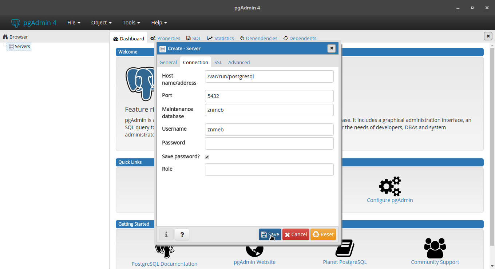

# Installing on Linux Mint

## Which version of Linux Mint do you have?
There are two versions of Linux Mint based on Ubuntu. The newer version, 18.x, is based on Ubuntu 16.04 LTS aka "Xenial Xerus". The older version, 17.x, is based on Ubuntu 14.04 LTS, "Trusty Tahr".

In the following, `<version>` refers to the Linux Mint version number, 18 or 17. If you have Ubuntu 16.04 LTS, the scripts for Linux Mint 18 should work, and the scripts for Linux Mint 17 should work on Ubuntu 14.04 LTS.

## PostgreSQL 9.6

1. Download these files.
2. Open a command prompt and enter

    ```
    chmod +x install-postgresql-<version>.bash
    ./install-postgresql-<version>.bash
    ```

    The script will

    1. Add the PostgreSQL Global Development Group repositories to your software sources.
    2. Install PostgreSQL 9.6, PostGIS 2.4, pgRouting 2.5, pgAdmin 4 and some GIS utilities.
    3. Add your Linux ID to the list of database superusers.
    4. Create a database with the same name as your user ID.

3. Start up pgAdmin and do the following:

    1. Right-click on "Servers" and create a new server.
    2. Fill in the name on the first tab.
    3. Fill in the connection details on the second tab.
    
        1. Host is "/var/run/postgresql" (without the quotes)
        2. Port is 5432
        3. User name and maintenance database are the same as your Linux user name
        4. Password is empty. If it ever asks you for a password again, give it an empty string.

4. Note that if you've installed older versions from the Mint / Ubuntu default repositories, you'll probably have to remove them before running this. I tested it on a Linux Mint 18 virtual machine, but it should work with any Ubuntu 16.04 LTS desktop.



## Docker Community Edtion / Docker Compose

`chmod +x install-docker-<version>.bash; ./install-docker-<version>.bash` - this will install both Docker Community Edition and Docker Compose.
