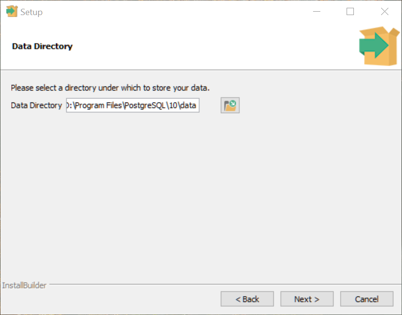
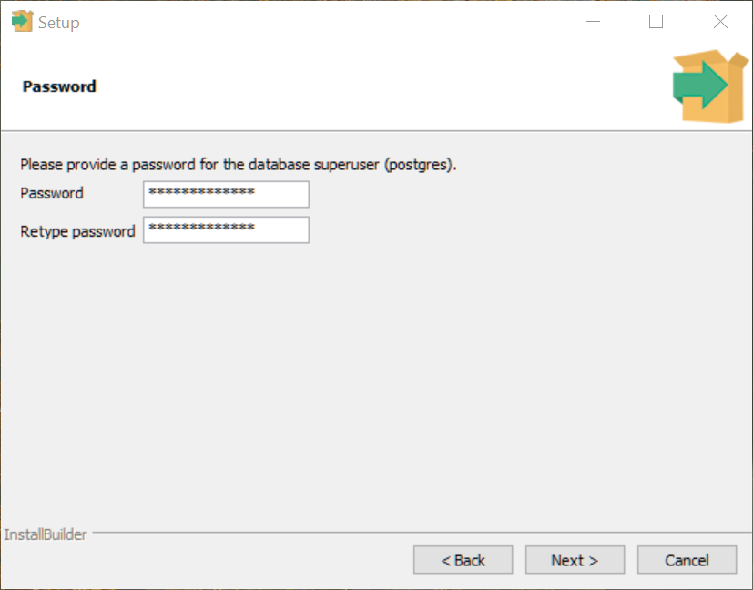
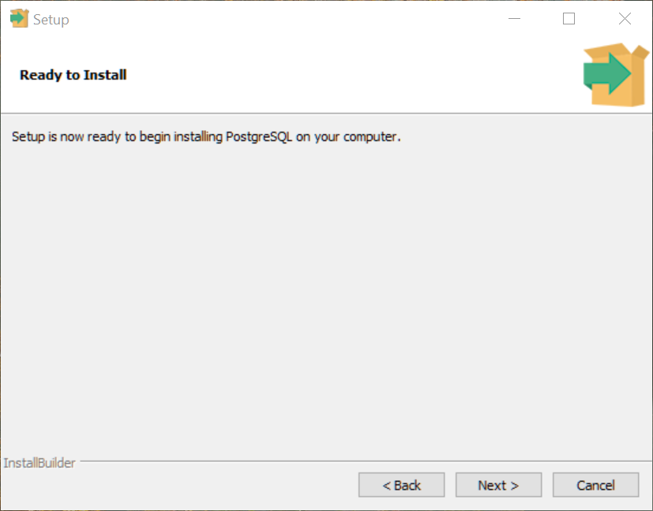
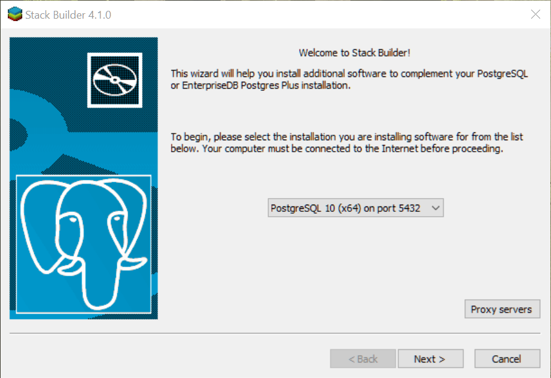
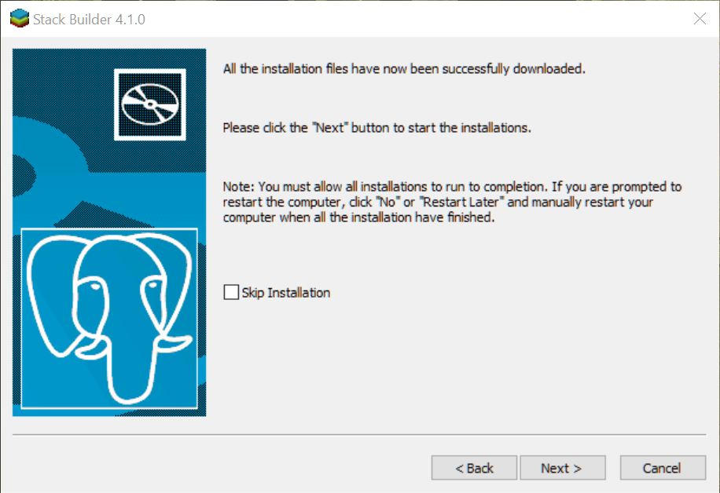
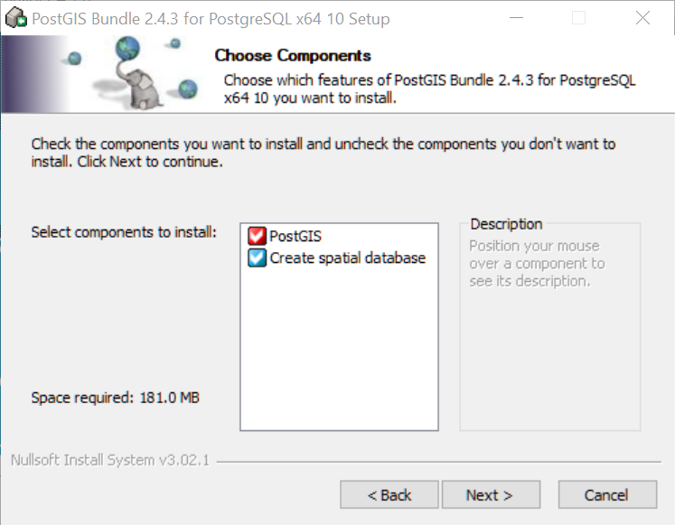
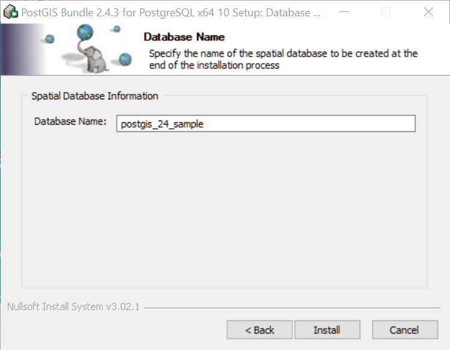
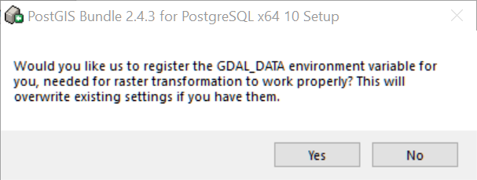
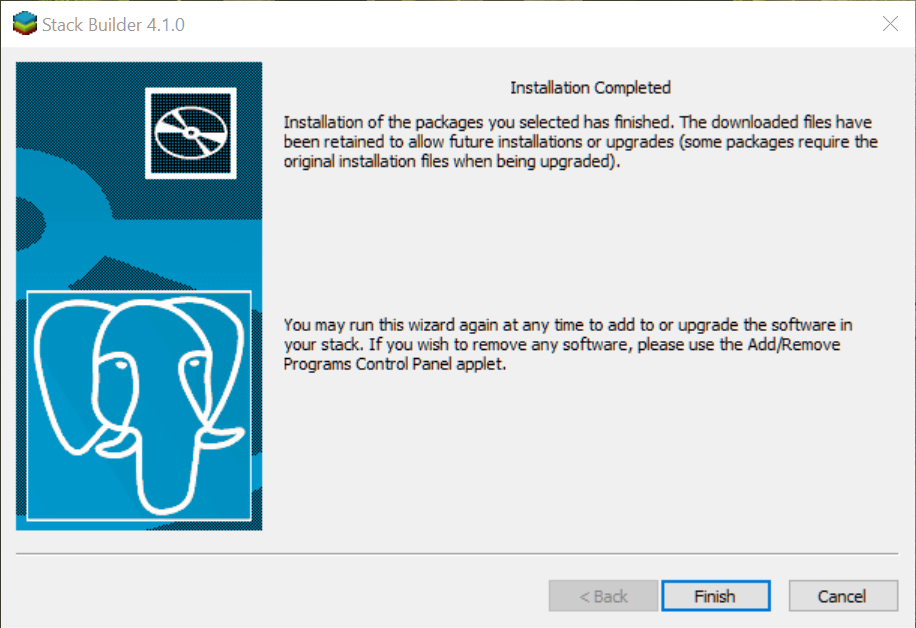

## head

## head

## head

## head

## head

## head

## head

## head

## head

## head

## head

## head

## head

## head

## head

## head

## head

## head

## head

## head

## head

## head

## head

