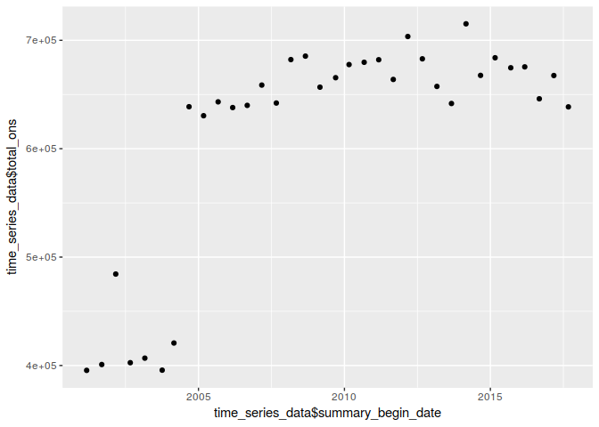

Passenger Census Time Series Analysis
================

## Load data from CSV

``` r
library(tidyverse)
```

    ## ── Attaching packages ─────────────────────────────────────── tidyverse 1.2.1 ──

    ## ✔ ggplot2 2.2.1     ✔ purrr   0.2.5
    ## ✔ tibble  1.4.2     ✔ dplyr   0.7.5
    ## ✔ tidyr   0.8.1     ✔ stringr 1.3.1
    ## ✔ readr   1.1.1     ✔ forcats 0.3.0

    ## ── Conflicts ────────────────────────────────────────── tidyverse_conflicts() ──
    ## ✖ dplyr::filter() masks stats::filter()
    ## ✖ dplyr::lag()    masks stats::lag()

``` r
passenger_census <- read_csv(
  "~/Raw/passenger_census.csv",
  col_types = cols(
    SUMMARY_BEGIN_DATE = col_date(format = "%d-%b-%y")
  )
)
colnames(passenger_census) <- tolower(colnames(passenger_census))
```

## Plot total ons as a time series

``` r
passenger_census %>% 
  group_by(summary_begin_date) %>% 
  summarize(total_ons = sum(ons)) %>%
  ungroup() %>%
  filter(summary_begin_date != "2001-01-01")  %>% 
  arrange(summary_begin_date) ->
  time_series_data
qplot(time_series_data$summary_begin_date, time_series_data$total_ons)
```

<!-- -->
