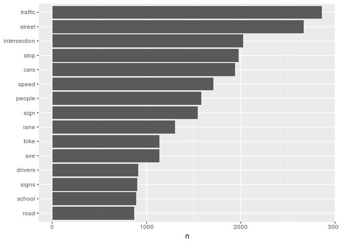

PUDL Safety Hotlines Topic Model
================

## Loading the libraries

``` r
if (!require("tidytext")) install.packages("tidytext")
```

    ## Loading required package: tidytext

``` r
if (!require("topicmodels")) install.packages("topicmodels")
```

    ## Loading required package: topicmodels

``` r
library("readr")
library("tidytext")
library("dplyr")
```

    ## 
    ## Attaching package: 'dplyr'

    ## The following objects are masked from 'package:stats':
    ## 
    ##     filter, lag

    ## The following objects are masked from 'package:base':
    ## 
    ##     intersect, setdiff, setequal, union

``` r
library("magrittr")
library("topicmodels")
library("ggplot2")
```

## Reading the data file

The safety hotline tickets dataset is a single CSV file with the
following columns: \* Item\_ID: A unique identifier for the entry \*
Date\_Created: the date in “yyyy-mm-dd” format, \* Description: the
description of the issue. This is the text we will be mining; each of
these will be a document \* Problem\_Location: a street address or
intersection \* X, Y, Longitude, Latitude: GIS coordinates

``` r
Safety_Hotline_Tickets <- read_csv(
  "~/Raw/Safety_Hotline_Tickets.csv", col_types = cols(
    Date_Created = col_date(format = "%Y-%m-%d"),
    Item_ID = col_character()))
```

    ## Warning in rbind(names(probs), probs_f): number of columns of result is not
    ## a multiple of vector length (arg 1)

    ## Warning: 6066 parsing failures.
    ## row # A tibble: 5 x 5 col     row col          expected           actual         file                expected   <int> <chr>        <chr>              <chr>          <chr>               actual 1     1 Date_Created date like %Y-%m-%d 1/10/2008 0:00 '~/Raw/Safety_Hotl… file 2     2 Date_Created date like %Y-%m-%d 3/13/2008 0:00 '~/Raw/Safety_Hotl… row 3     3 Date_Created date like %Y-%m-%d 3/13/2008 0:00 '~/Raw/Safety_Hotl… col 4     4 Date_Created date like %Y-%m-%d 3/21/2008 0:00 '~/Raw/Safety_Hotl… expected 5     5 Date_Created date like %Y-%m-%d 3/21/2008 0:00 '~/Raw/Safety_Hotl…
    ## ... ................. ... .......................................................................... ........ .......................................................................... ...... .......................................................................... .... .......................................................................... ... .......................................................................... ... .......................................................................... ........ ..........................................................................
    ## See problems(...) for more details.

## Extracting the words from the documents (Silge and Robinson 2017, chap. 1)

The first step is to create a data frame, called “raw\_words”, that
contains one row for each word that occurs in any description. Once we
have that, we remove “stop words”. Stop words are words that are
considered noise. We use the default English stop words from the
TidyText package, augmented with a dataset-specific set.

In looking at the data, I found that Portland areas “NW”, “NE”, etc.,
occurred frequently. Since the dataset includes both a text definition
of the location and GIS coordinates, these designators add no value and
should be considered stop words.

``` r
# Load the TidyText default stop words
data("stop_words")

# add our own stop words and save
pdx_stop_words <- tribble(
  ~word, ~lexicon,
  "n", "pdx_stop_words",
  "ne", "pdx_stop_words",
  "se", "pdx_stop_words",
  "sw", "pdx_stop_words",
  "nw", "pdx_stop_words"
) %>% 
  bind_rows(stop_words) %>% 
  write_csv(path = "~/Raw/pdx_stop_words.csv")

raw_words <- Safety_Hotline_Tickets %>% 
  select(Item_ID, Description) %>% 
  unnest_tokens(word, Description) %>% 
  anti_join(pdx_stop_words)
```

    ## Joining, by = "word"

## Visualizing the most common words (Silge and Robinson 2017, chap. 1)

``` r
word_counts <- raw_words %>%
  count(word, sort = TRUE) %>% 
  mutate(word = reorder(word, n))
word_counts %>% 
  top_n(15) %>% 
  ggplot(aes(word, n)) +
    geom_col() +
    xlab(NULL) +
    coord_flip()
```

    ## Selecting by n

<!-- -->

## Creating the document-term matrix (Silge and Robinson 2017, chap. 3)

The document-term matrix is the fundamental representation of a corpus
of documents. In this case the documents are the issue descriptions as
noted above. This step has no visualizations; it’s only here to provide
a document-term matrix `safety_dtm` for the topic model.

``` r
line_words <- raw_words %>% 
  count(Item_ID, word, sort = TRUE) %>% 
  ungroup()
total_words <- line_words %>% 
  group_by(Item_ID) %>% 
  summarize(total = sum(n))
line_words %<>% left_join(total_words) %>% 
  bind_tf_idf(word, Item_ID, n)
```

    ## Joining, by = "Item_ID"

``` r
safety_dtm <- line_words %>% 
  cast_dtm(Item_ID, word, n)
```

## Latent Dirichlet analysis / topic model (Silge and Robinson 2017, chap. 6)

The final step is a latent Dirichlet analysis to determine the topics.
This is a kind of unsupervised learning / clustering operation. We don’t
know going in how many topics there will be - we have to start with a
small number and use our insights about the subject matter to tell us
when to stop.

``` r
safety_lda <- LDA(safety_dtm, k = 5, control = list(seed = 1234))
safety_topics <- tidy(safety_lda, matrix = "beta")
top_terms <- safety_topics %>%
  group_by(topic) %>%
  top_n(10, beta) %>%
  ungroup() %>%
  arrange(topic, -beta) %>% 
  write_csv(path = "~/Raw/top_terms.csv")
```

## References

<div id="refs" class="references">

<div id="ref-silge2017text">

Silge, J., and D. Robinson. 2017. *Text Mining with R: A Tidy Approach*.
O’Reilly Media. <https://www.tidytextmining.com/>.

</div>

</div>
