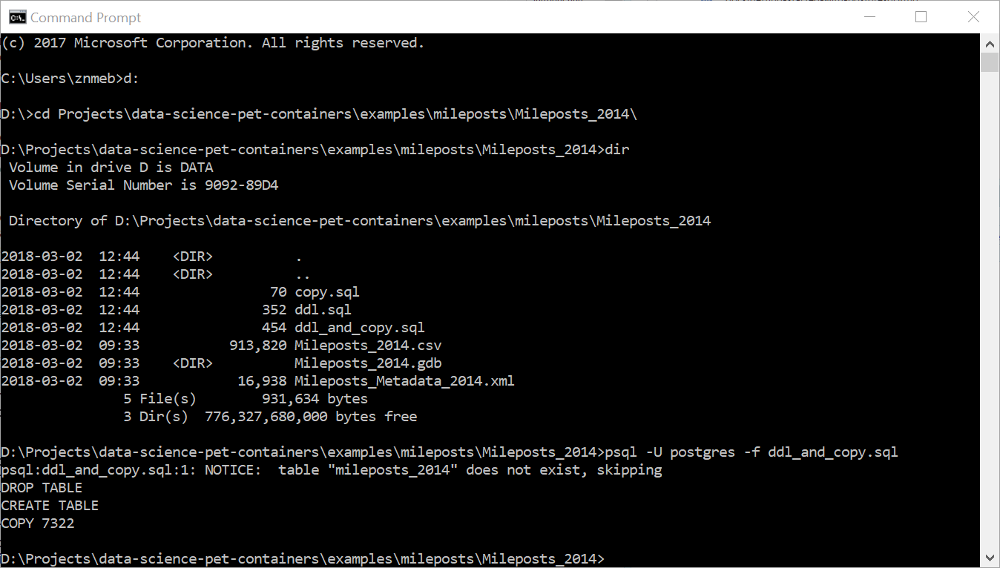
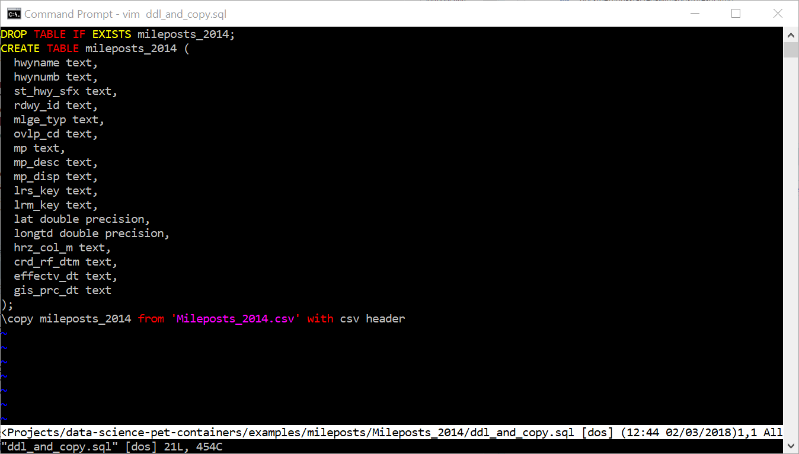

# Introduction: PostgreSQL in Context

## Industry trends: NoSQL databases [@Redmond2012]
* Graph databases
* Key-value stores
* JSON document stores
* In-memory databases

## Industry trends: Backend frameworks (Apache/PHP, Ruby on Rails, Django)
* Work with *any* database (MySQL/MariaDB, SQLite, PostgreSQL)
* Just use the database for CRUD, application logic is all in PHP / Ruby / Python / JavaScript code!
* Wait - CRUD?
    - Create
    - Read (aka SELECT)
    - Update
    - Delete

## If all you want ...
* If all you want is an industrial-strength open-source permissive-licensed CRUD engine that
    - Is fully ACID compliant
    - Scales to huge installations
    - Has replication / failover / high availability as standard equipment
* Yeah, PostgreSQL's got that.

## But if you also want ...
* Full-text search
* Stored procedures in Python, Perl, Ruby, R, Tcl and Lua
* Foreign data (Text files, GIS data, MySQL/MariaDB, Redis) mapped into your database (foreign data wrappers)
* Key-value stores (hstore)
* JSON document stores (jsonb)
* Yeah, PostgreSQL's got that too!

## Speaking of industrial strength ...
* Geographic Information Systems (GIS)
* PostGIS [@Obe2015]
    - Read and write GIS data files
    - Process geometric, geographic and topology GIS data types
    - Both vector and raster data
     - Geocoding, reverse geocoding, address standardization
* pgRouting [@Obe2017]
    - Shortest / fastest / lowest cost routes from point A to point B
    - Traveling salesperson problem
    - Turn-by-turn directions for cars, bikes and pedestrians!
* Yeah, I want that CRUD too!

# PostgreSQL on the Desktop - single user

## Windows or Mac
* Go to EnterpriseDB download site <https://www.enterprisedb.com/downloads/postgres-postgresql-downloads>.
* Select the latest version (10.3)
* Select your operating system (Windows or Mac)
* Installation: install everything but don't run StackBuilder yet
    - Screenshots: <https://github.com/hackoregon/data-science-pet-containers/blob/master/docs/windows-install-screenshots.pdf>

## Linux: use the PGDG repositories
* RHEL / CentOS / Fedora: <https://www.postgresql.org/download/linux/redhat/>
* Linux Mint 18 / Ubuntu 16.04 LTS ("Xenial"): <https://github.com/hackoregon/data-science-pet-containers/blob/master/docs/Mint18-Xenial/README.md>
* Debian: <https://www.postgresql.org/download/linux/debian/>
* Installation: install PostgreSQL 10.3 and pgAdmin 4 for desktop

## Connecting with pgAdmin - [@Obe2017a, chapter 4]
1. Right-click on "Servers"
2. Create a server
3. Give it any name you want
4. Fill in the connection tab

## EnterpriseDB connection
* Host: localhost
* Port: 5432
* Maintenance database and user are postgres
* Password is what you set when you installed

## Linux connection (at least on Mint / Ubuntu)
* Host: /var/run/postgresql
* Port: 5432
* Maintenance database and user are the same as your Linux ID
* Password is empty
* See <https://github.com/hackoregon/data-science-pet-containers/blob/master/docs/Mint18-Xenial/README.md> for setup steps

## Exploring the tree (pgAdmin live)

## Creating a database (pgAdmin live)

## Creating tables - Data Definition Language (DDL)
To create a table, you need to do two things:

1. Define the names and data types of every column in the table.
2. Load the data into the table.

We'll be working with a sample file of Oregon highway mileposts. You'll find it in <https://github.com/hackoregon/data-science-pet-containers/blob/master/examples/mileposts/Mileposts_2014/Mileposts_2014.csv>.

## A cheat code if you're in a hurry
If you don't know the data types, you can always just set them all to `text` and re-cast them to the correct type with SQL later! But in this case it's mostly obvious which columns are numeric or timestamps, and we can use text for the rest.

For the mileposts, we'll use `double precision` for the latitude and longitude and `text` for the others.

## The DDL
```{sql eval=FALSE}
CREATE TABLE mileposts_2014 (
  hwyname text, hwynumb text, st_hwy_sfx text,
  rdwy_id text, mlge_typ text, ovlp_cd text,
  mp text, mp_desc text, mp_disp text,
  lrs_key text, lrm_key text, 
  lat double precision, longtd double precision, 
  hrz_col_m text, crd_rf_dtm text, effectv_dt text,
  gis_prc_dt text);
```

## Hey, Ed, what's with all the lower case names?
PostgreSQL requires special care in coding SQL queries when column names have anything besides lower-case letters, numbers or underscores. You have to enclose them in double-quotes. It's a real hassle, so "snake_case" rules!

## Loading the data into the table: `psql` `\copy`
* `psql` is the command-line PostgreSQL client.
* It's fully scriptable - you can write programs in it.
* It has string substitution.
* You can mix SQL statements and `psql` commands
* It's great for reproducibility
* But it's another language to learn 
    - most folks will script in a language they know, like Python, which has its own PostgreSQL client libraries.

## Mixing SQL and `psql`
* Script: <https://github.com/hackoregon/data-science-pet-containers/blob/master/examples/mileposts/Mileposts_2014/ddl_and_copy.sql>
* To run it, we type `psql -f ddl_and_copy.sql`.

## This is what it looks like in a Windows `cmd` window



## And the `psql` script file looks like this



## Examining the table (pgAdmin live)

## Backing up a database: `pg_dump` (pgAdmin live)

## Restoring a database: `pg_restore` (pgAdmin live)

# PostgreSQL on a (Linux) Server

## And now for something completely different
* On a desktop, you're usually the database superuser
    - Everything works, and your machine's behind a firewall
* On a server, there's a DBA and a SysAdmin that hand out privileges only with justification
    - You don't get it unless you need it, and everything you do is logged and monitored
* Bottom line: don't be surprised if you get told, "No! Find another way."

## Two most common server dialects of Linux
* Ubuntu 16.04.x LTS (most popular)
* RHEL 7 / CentOS 7

## An aside - PostgreSQL in a Docker container
* Usually Debian stable - similar to Ubuntu
* Sometimes Alpine - avoid this unless you want to do a lot of research
* I have a full PostgreSQL / PostGIS / pgRouting stack in a container at <https://github.com/hackoregon/data-science-pet-containers>.
    - See <https://github.com/hackoregon/data-science-pet-containers/blob/master/containers/small.yml> for the Docker compose file
    - The documentation's a bit sparse still
    - Native executables will perform better
    - Docker hosting on a desktop / laptop isn't exactly end-user friendly yet

## The PGDG repositories
* Linux distributions ship with the version of PostgreSQL that was stable when their release process froze features.
* You'll still get security updates and bug fixes, but no new features.
* So the PostgreSQL Global Development Group (PGDG) maintains up-to-date binary repositories for all the major Linux distros.
* These binaries are as well tested and supported as those that ship with the Linux distros.
* Download page: <https://www.postgresql.org/download/>

## Configuring
* Initializing the cluster: `initdb`
    - <https://www.postgresql.org/docs/10/static/app-initdb.html>
    - By the way, _cluster_ is a "cluster of databases"
* Enabling and starting the service: `systemctl`

## Listening address and port
* Edit `postgresql.conf`
    - <https://www.postgresql.org/docs/10/static/runtime-config.html>
    - <https://www.postgresql.org/docs/10/static/config-setting.html#CONFIG-SETTING-CONFIGURATION-FILE>
* Restart the service

## Authentication
* Edit `pg_hba.conf`
    - <https://www.postgresql.org/docs/10/static/auth-pg-hba-conf.html>
* Restart the service

## Fine-grained permissions and roles
* Adding a user  (pgAdmin live)
* SQL `GRANT` and `REVOKE`
    - <https://www.postgresql.org/docs/10/static/user-manag.html>

# PostGIS

## Installing PostGIS
* Windows and Mac - use the Stack Builder
    - You'll get `pgRouting` too
    - You'll get the command-line GIS utility `gdal`
* Linux: use the PGDG repositories
    - You'll need to install `pgRouting` and `gdal` explicitly

## Reading in GIS data [@Obe2015, chapter 4]
* Shapefiles (live command line demo)
* "GDB" databases (live command line demo)
* OpenStreetMap data (live command line demo)

## Tagging points with a geometry column (pgAdmin live)

## Geocoding [@Obe2015, chapter 8]
* There's a demo using a Docker container at <https://github.com/hackoregon/data-science-pet-containers/tree/master/examples/geocoding>.
* This uses a container running Debian Linux with a full PostgreSQL / PostGIS / pgRouting stack.
* ***I have not tested it on a Windows Docker host, just Linux. It undoubtedly needs some adjustments for the volumes mounted on host filesystems.***

# References

## References
