## Welcome screen

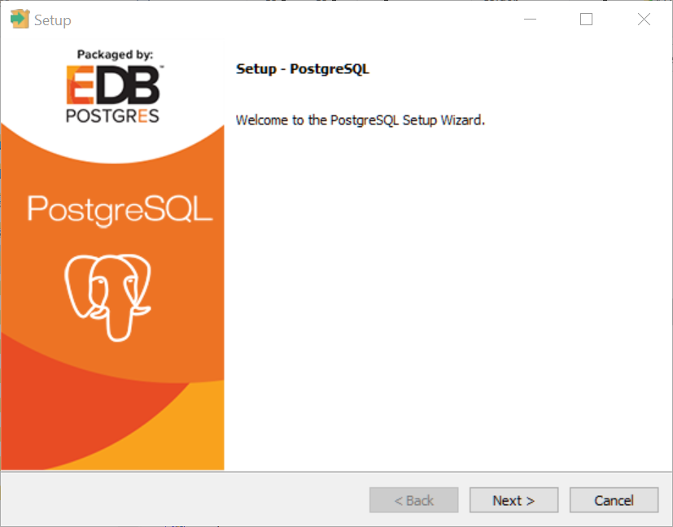{width=80%}

## D: is my 1 TB magnetic drive; C: is a 128 GB SSD

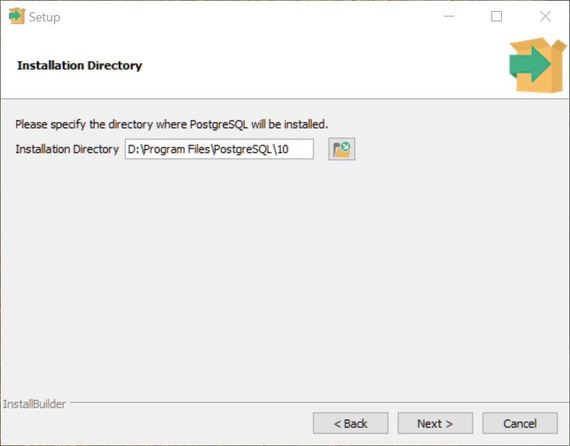{width=80%}

## Install everything

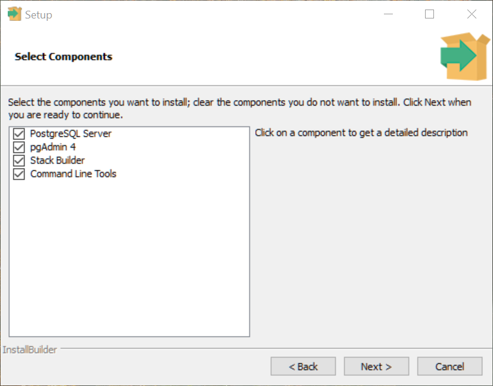{width=80%}

## Put the data on the 1 TB drive too

{width=80%}

## Set the `postgres` password

{width=80%}

## The default port

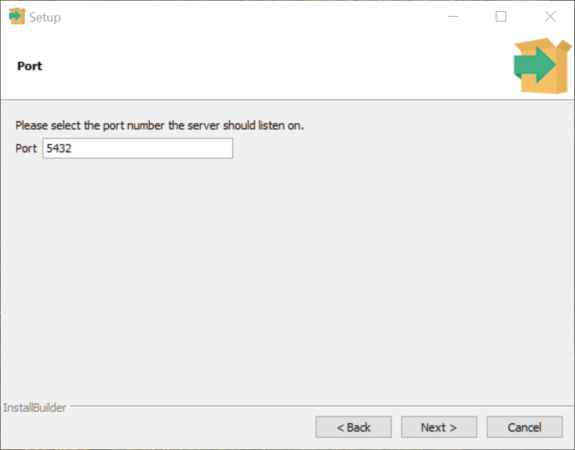{width=80%}

## Set the locale to English, US

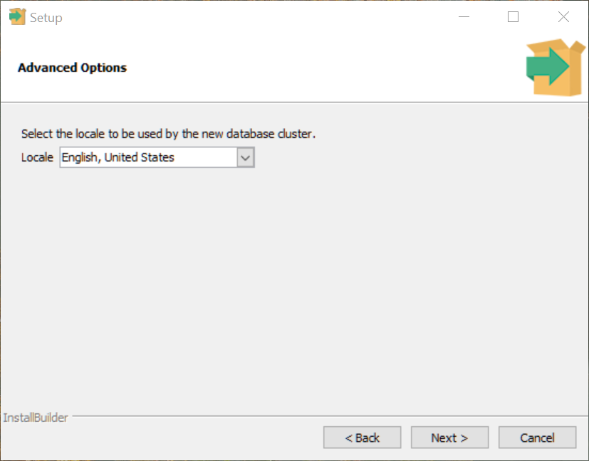{width=80%}

## Check for errors; use `Back` to fix

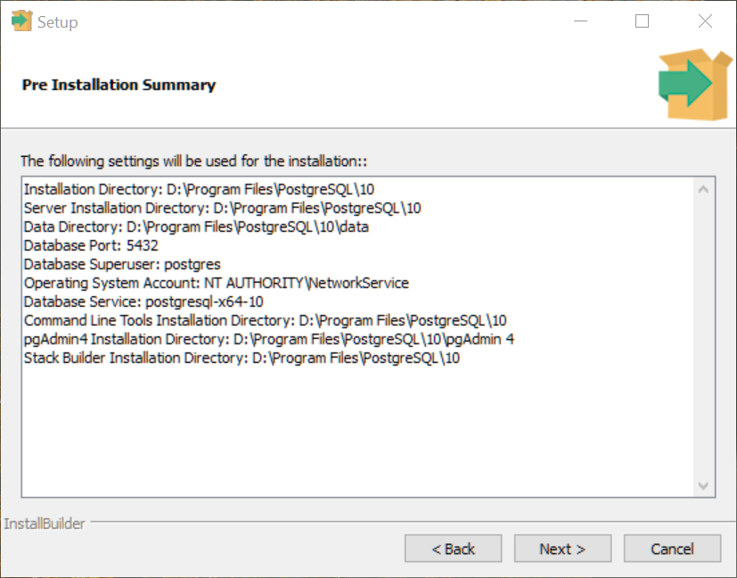{width=80%}

## Let's do this!

{width=80%}

## All done! Uncheck the Stack Builder and finish

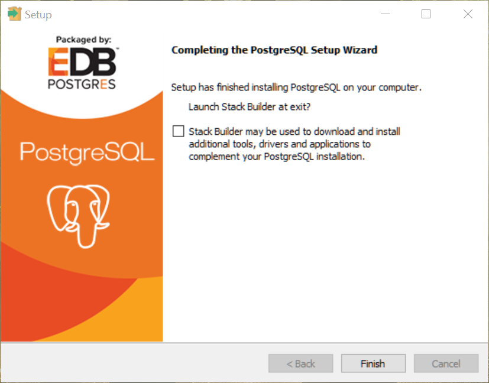{width=80%}

## The Stack Builder is in your Start Menu - start it

{width=80%}

## The goodies we're installing are listed at the bottom

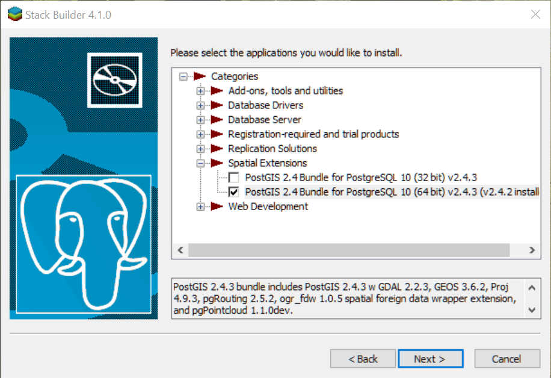{width=80%}

## I save all my installers on my 1 TB drive

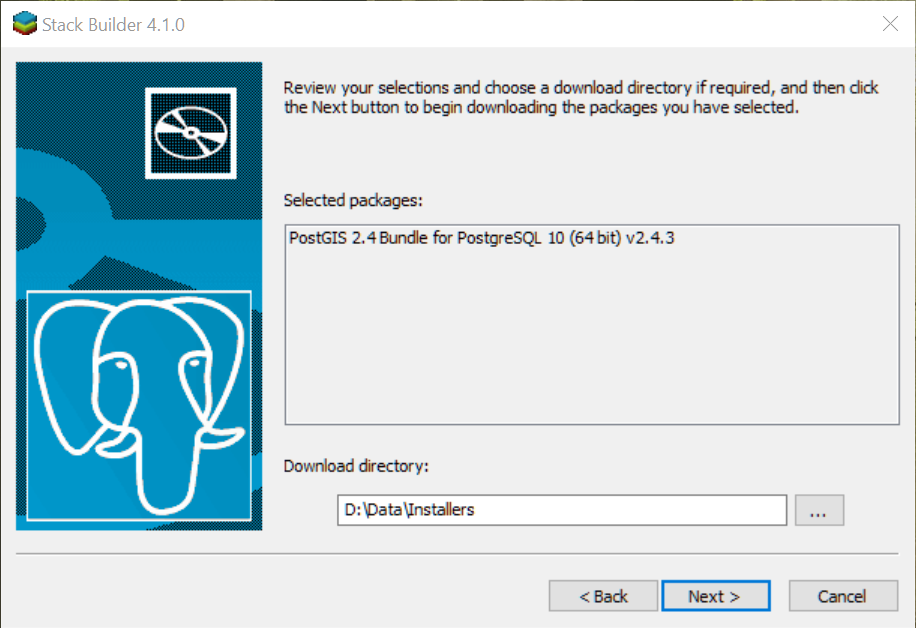{width=80%}

## Press "Next"

{width=80%}

## Accept the license

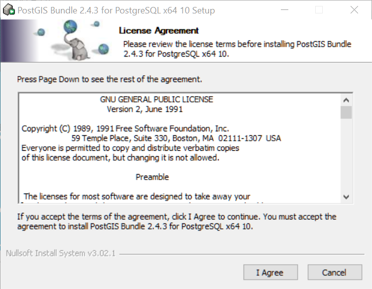{width=80%}

## Accept the sample database

{width=80%}

## You shouldn't have to change this

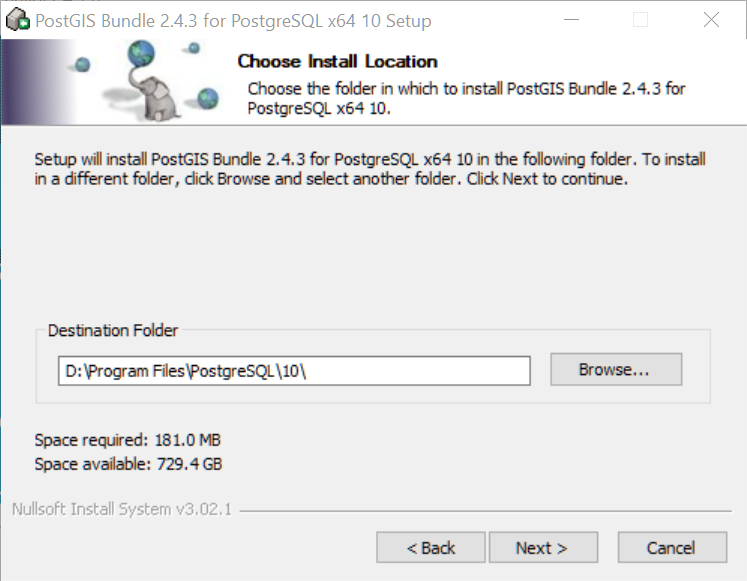{width=80%}

## Sign in with the password you set when you installed PostgreSQL

{width=80%}

## Don't change this

{width=80%}

## Yes

{width=80%}

## Yes

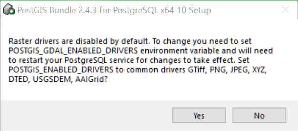{width=80%}

## Yes

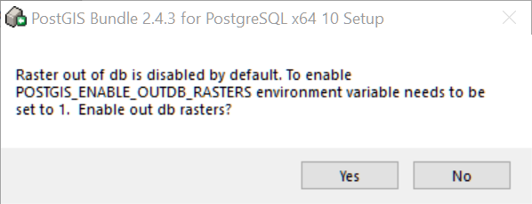{width=80%}

## Finish!

{width=80%}

